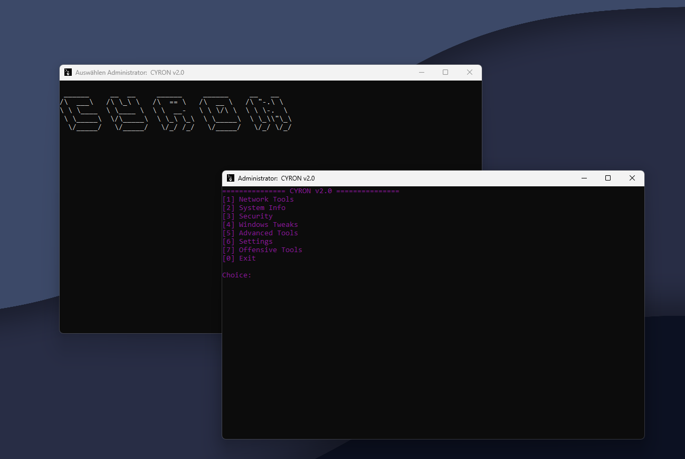

# CYRON

**CYRON** is a comprehensive toolkit designed for managing system settings, security, network tools, and more, specifically for Windows. The project includes a variety of utilities for users, administrators, and security enthusiasts.


## Screenshot



## Key Sections

- **Network Tools**
- **System Info**
- **Security Tools**
- **Windows Tweaks**
- **Advanced Tools**
- **Offensive Tools**
- **Settings**

[Projektstruktur anzeigen](./assets/struktur.txt)


## Current Status

Not all tools are fully functional yet. Some tools are currently placeholders or simulated and will later be replaced by Python scripts that will power **CYRON 2.0**.

## How to Run

1. Clone the repository to your local machine:
   ```bash
   git clone https://github.com/PGSyntax/CYRON.git
Navigate to the project folder:
cd CYRON

Run the main batch file:
CYRON v2.0.bat
